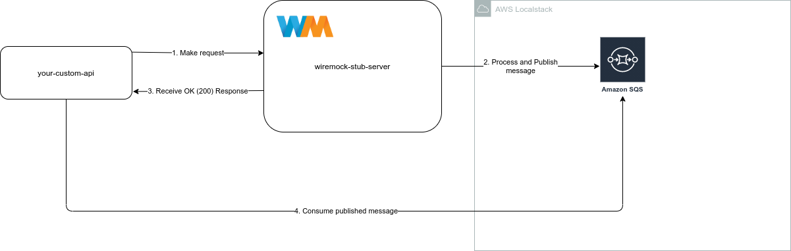

# send-sqs-wiremockextension
  

Send-SQS-Transform is a [Wiremock](http://wiremock.org/) extension to send sqs message in background when receive a request in stub-server to validate async backend scenarios.

In simples words, when request is defined in mapping, you can send metadata to define a message to send in background to an amazon sqs queue.
Like example below:




## Docker instructions

To run wiremock extension in docker is necessary to already have running a valid `sqs-queue`, so depend on you run first a localstack container.

```shell
docker run --name wiremock-extension --network (your local stack network) \ 
            -v $(pwd)/mocks/mappings:/home/wiremock/mappings \
            -p 8080:8080 yanbrandao/send-sqs-wiremock-extension:0.0.1 \
             --extensions "com.github.extension.SendSQSTransform"
```

In this command we define:
 - container `name` for better track in docker
 - `network` to connect with your localstack
 - `volume` to manage your mappings
 - `port` to connect locally with wiremock
 - `--extensions` to call wiremock to load your custom extension 

for `docker-compose` executions, we give an example in root folder of the project.

## Using instructions

To use transform, is necessary to make you request mapping according to following line:

```json
{
  "request": {
    "method": "(GET, POST, or etc...)",
    "url": "/you-mock-endpoint",
    "bodyPatterns" : [
      {
        "matchesJsonPath" : "$.metadata.queue_name"
      },
      {
        "matchesJsonPath" : "$.metadata.profile"
      },
      {
        "matchesJsonPath" : "$.metadata.container_address"
      },
      {
        "matchesJsonPath" : "$.data"
      }
    ]
  },
  "response": {
    "status": "(Any status return)",
    "transformers": ["async-send-sqs"]
  }
}
```

First, in `bodyPatterns`, is necessary to receive metada object, with following attributes:

 - `queue_name` the name of queue to send to sqs
 - `profile` the profile to load correct environment, you can use `InDocker`, `Cloud` or `Local`
 - `container_name` in `InDocker` profile, is necessary to info the localstack container name.
 
 At least is necessary to send message data to `sqs`, all fields can be sent in data object, like payload below:

 ```json
{
    "metadata": {
        "queue_name": "sample-queue",
        "profile": "InDocker",
        "container_address": "172.31.0.3"
    },
    "data": {
        "name": "just a test"
    }
}
 ```

 If you are running InDocker profile, to get `container_address` just inspect your localstack container: 
 ```shell
 docker container inspect localstack | grep IPAddress
``` 

 the message in your `sqs` will be like this:

 ```json

 {
    "Messages": [
        {
            "MessageId": "b2b33c93-7911-da99-1279-7b4a49360b77",
            "ReceiptHandle": "jupkihjcjvgzxsnecwlborxakjuqbicosdqyhyqbmynlocljrqjfyedooijfezknbrmxlozgimjylulclkjhkzelovshghnevsfnwjxmfsuvnvuuxvlpalnmfdttfdgjofvoipyaqwszjikqcqulxdmplqaiojavonvtvqptcrfpozdgevhvctmed",
            "MD5OfBody": "97b7e9e2435616e00f5301eb638a806b",
            "Body": "{name=\"just a test\"}",
            "Attributes": {
                "SenderId": "AIDAIT2UOQQY3AUEKVGXU",
                "SentTimestamp": "1644726125589",
                "ApproximateReceiveCount": "1",
                "ApproximateFirstReceiveTimestamp": "1644726135340"
            }
        }
    ]
}

```


